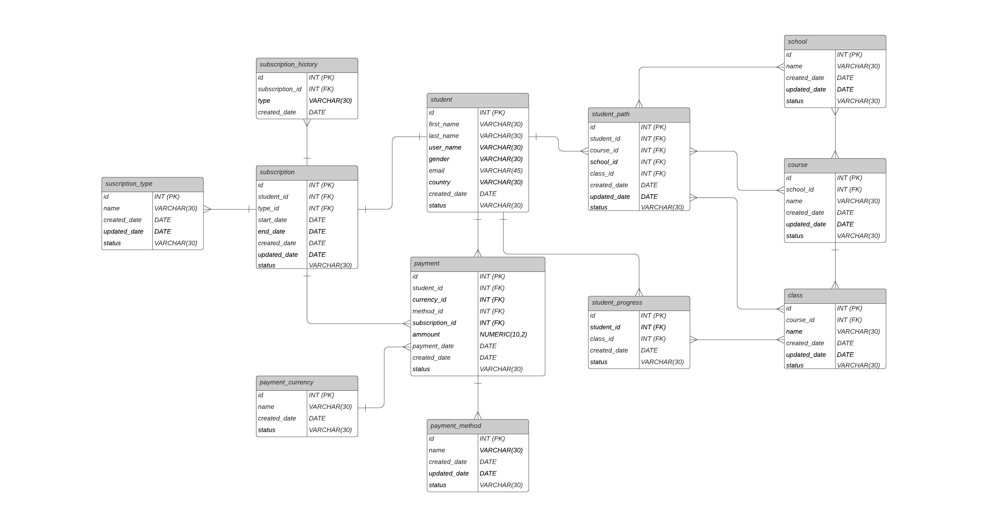
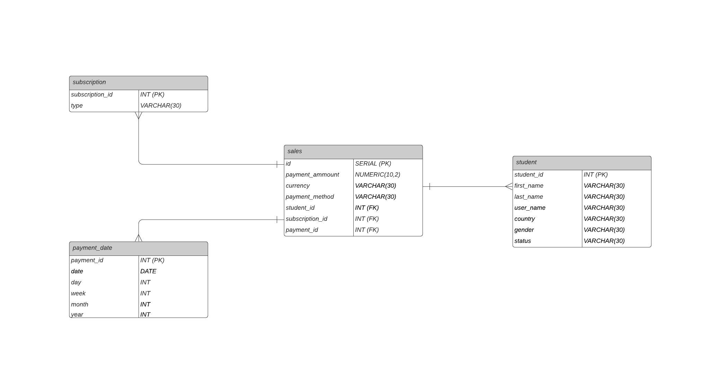
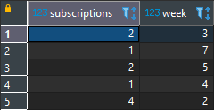
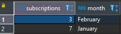
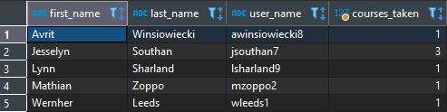
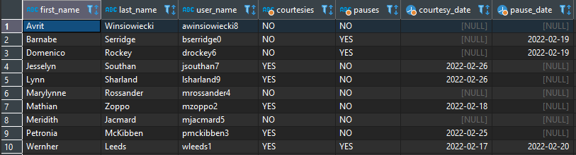

# Data Engineer Test Solution

## Requirements
- Python 3.9 or greater
- Pip
- Docker
- docker-compose

## Setup
1. Create the Python venv with 
```
python -m venv env
```
2. Use the `requirements.txt` to install the required libraries
```
pip install -r requirements.txt
```
3. The project is using Docker to run a Database on PostgreSQL 12, so, build the docker project with compose
```
docker-compose up -d
```
4. Once all the steps are completed, just run `main.py` to start the ETL process
```
python main.py
```
5. You can connect to the Database using your preferred database management software with the following credentials:
```
host="localhost",
database="postgres",
user="postgres",
password="dataplatzi"
```

## Database
ER Model


Star Model


## Queries
- **Cómo podemos saber cuántos estudiantes nuevos tenemos por suscripción semana a semana y mes por mes:**

Semana a semana:
```
SELECT count(s.student_id) AS subscriptions, date_part('week', s.start_date) AS week
FROM "subscription" s 
GROUP BY week 
```


Mes por mes:
```
SELECT count(s.student_id) AS subscriptions, to_char(s.start_date, 'Month') AS month
FROM "subscription" s 
GROUP BY month 
```


- **Cuántos cursos ha tomado el estudiante con más del 80% de las clases vistas?**
```
WITH student_classes AS (
	SELECT sp.student_id, cs.id AS course_id,  count(sp.class_id) count_classes
	FROM student_progress sp
	JOIN "class" cl ON sp.class_id = cl.id
	JOIN course cs ON cl.course_id = cs.id
	WHERE sp.status = 'completed'
	GROUP BY sp.student_id, cs.id
), count_classes AS ( 
	SELECT cl.course_id ,count(cl.course_id) count_total_courses
	FROM "class" cl 
	GROUP BY cl.course_id 
), total AS (
	SELECT sc.student_id, cc.course_id, (count_classes::numeric(3,2) / count_total_courses::numeric(3,2))* 100 > 80 AS average_classes
	FROM student_classes sc
	JOIN count_classes cc ON sc.course_id = cc.course_id
	GROUP BY sc.student_id, cc.course_id, count_classes, count_total_courses
)
SELECT s.first_name, s.last_name, s.user_name , count(t.course_id) AS courses_taken
FROM student s
LEFT JOIN total t ON t.student_id = s.id
LEFT JOIN course cr ON t.course_id = cr.id
WHERE average_classes = TRUE 
GROUP BY s.first_name, s.last_name, s.user_name
```


- **El estudiante ha tenido pausas o cortesías en su suscripción?**
```
WITH courtesy AS (
	SELECT s.student_id, sh."type" AS courtesy, sh.created_date
	FROM subscription_history sh 
	JOIN "subscription" s ON s.id = sh.subscription_id 
	WHERE sh.TYPE = 'COURTESY'
	GROUP BY s.student_id, sh."type",sh.created_date
), pauses AS (
	SELECT s.student_id, sh."type" AS pauses, sh.created_date 
	FROM subscription_history sh 
	JOIN "subscription" s ON s.id = sh.subscription_id 
	WHERE sh.TYPE = 'PAUSED'
	GROUP BY s.student_id, sh."type",sh.created_date
)
SELECT st.first_name, st.last_name, st.user_name,
	CASE 
		WHEN courtesy IS NOT NULL THEN 'YES'
		ELSE 'NO'	
	END AS courtesies, 
	CASE 
		WHEN pauses IS NOT NULL THEN 'YES'
		ELSE 'NO'
	END AS pauses,
	cs.created_date AS courtesy_date,
	ps.created_date AS pause_date
FROM student st
LEFT JOIN courtesy cs ON st.id = cs.student_id
LEFT JOIN pauses ps ON st.id = ps.student_id
ORDER BY first_name
```


## Technology Stack
This project was built using Python 3.9 and uses the following technologies:
- Pandas 1.3.5
- psycopg2 2.9.3
- PostgreSQL 12
- Docker