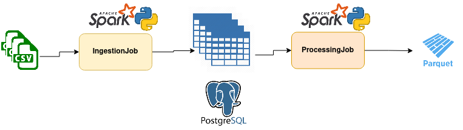

***Platzi- Take home exercise description [[Source](https://github.com/PlatziDev/Data-Engineer-Test/blob/master/README.md)]***
### Relational Model

### Star Model to analyze Platzi's payments and money

### ETL process
#### Requirements
- Docker [[install-guide](https://docs.docker.com/engine/install/)]
- Docker-compose [[install-guide](https://docs.docker.com/compose/install/)]
- JVM [[install-guide](https://sdkman.io/install)]
  * ETL process was developed using Spark and this was developed in Scala that runs on JVM machine
  * It is needed the JAVA_HOME var set
#### Architecture

#### Instructions
I used fake data from [[mockaroo](https://www.mockaroo.com/)] to generate csv input files. ***It could have been used sql insert statements to generate fake data, but I prefer to use a spark job just for the sake of having a better programming structure of the project, or how I imagined it could be in terms of coding***

1. Spin up the containers where the docker-compose file is allocated
<pre>
$ sudo docker-compose up -d
</pre>

Now, you should see two docker images: **adminer** and **postgres**, ports **8080** and the classic **5432** 

2. Open a browser and go to http://localhost:8080

Login:
<pre>
Server: db
Username: platzi   
Password: platzi
Database: platzi
</pre>
Once you went to http://localhost:8080, create the input tables using the script **sql/creation_table_ddl.sql**, you should see something like:

3. Install the project into a python virtual environment
<pre>
$ python3 -m venv /path/to/new/virtual/environment
$ pip3 install -r requirements.txt 
</pre>

4. Execute the spark jobs taking into account that the working directory is **project/src** 

Entry point of the program is the driver allocated in **project/src/platzi_driver.py**, it receives the following params for ingestion and processing job:

Ingestion:
<pre>
 --config-file platzi_conf.json --job-type ingestion_job --app-name app_ingestion
</pre>
Processing:
<pre>
$ --config-file platzi_conf.json --job-type processing_job --app-name app_processing
</pre>
