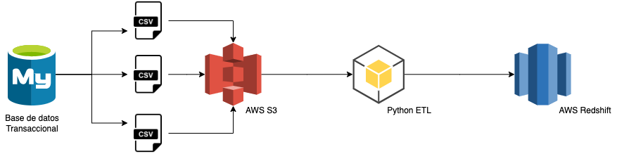

# **Modelo dimensional con Python y AWS**

En el presente proyecto, se realiza un programa en Python que actualiza un modelo dimensional en Redsfhit.

Se parte de los datos creados por una base de datos transaccional ya depositados en el storage de S3. 


## **REQUERIMIENTOS**
En platzi, ofrecemos educación online efectiva a estudiantes de todo el mundo, el modelo de negocio funciona de la siguiente manera

- Un estudiante puede adquirir 3 tipos de suscripciones pagas
- Existen distintos métodos de pago que se clasifican en recurrente y no recurrente
- Un estudiante puede pagar su suscripción con mas de un método de pago, es importante saber cuánto se pago, en que currency y en que fecha
- Es importante saber cuando un estudiante inicia y termina su suscripción
- Un estudiante puede pausar su suscripción o se le pueden dar meses de cortesía, y es necesario saber cuándo ocurre cada evento de pausa o cortesía
- Un estudiante puede tomar cursos, escuelas y clases
- Una escuela está conformada por cursos, y un curso está conformado por clases
- Además un estudiante puede ingresar a sesiones en vivo o blogs de la plataforma

1. Crear un modelo relacional que pueda soportar la lógica de negocio anterior
2. Crear un modelo BI en estrella o snowflake para analitica de datos, para analizar los pagos en platzi y el dinero que se obtiene.
3. Consultas sql:

En tu modelo de datos:

- cómo podemos saber cuántos estudiantes nuevos tenemos por suscripción semana a semana y mes por mes
- ¿Cuántos cursos ha tomado el estudiante con más del 80% de las clases vistas?
- ¿El estudiante ha tenido pausas o cortesías en su suscripción?

4. Crea un proceso de ETL en python/spark/sql o el lenguaje que creas conveniente con el objetivo de migrar los datos del modelo relacional que creaste anteriormente hasta el modelo estrella o snowflake que también creaste previamente. Queremos que nos demuestres tus habilidades como data cleaning y uso de pandas. 

## **INSTALACIÓN Y USO**
Para el uso de la aplicación es necesario tener instalado docker, y de esta manera poder ejecutar el proyecto dentro de un contenedor. [Instalacion de docker](https://docs.docker.com/engine/install/) 
1. Creamos la imagen configurada previamente
```bash
  docker build --tag platzi-etl-python .
```
2. Ejecutamos el docker, que internamente ejecuta el programa en Python
```bash
docker run platzi-etl-python
```
3. En este punto deberíamos empezar a ver el log de ejecución.
<figure align="center">
  </>
</figure>
4. Usando cualquier gestor de bases de datos, podemos conectarnos a la base de datos de Redshift y validar la informacion.
<figure align="center">
  </>
</figure>

## **DESARROLLO**
### **Modelo Relacional**
<figure align="center">
  </>
  <figcaption>Platzi Relational Model</figcaption>
</figure>

### **Modelo Dimensional**
Para el modelo dimensional se crearon dos tablas de hechos y 6 dimensiones:
- **df_dimStudents:** Contiene la información de los estudiantes con la información básica y de contacto.
- **df_dimPaymenthMethod:** Contiene la información de los distintos metodos de pago, se obtiene de la tabla transaccional de las subscripciones, tomando los distintos tipos de pagos nuevos que puedan generarse
- **df_dimClass:** Todas las escuelas, cursos y clases están contenidas en la dimension Class, ya que podemos generar una jerarquía desde la escuela hasta la clase. Podría ser una dimensión Tipo 2, dependiendo de que tan seguido se modifiquen las clases.
- **df_dimEvent:** Esta dimensión contiene los eventos que pueden afectar el estado de subscripción de un estudiante, como las pausas, cortesias, pagos, etc.
- **df_dimFrequency:** Contiene las posibles frecuencias de los pagos. Se obtiene de la tabla transaccional de subscripciones y basicamente tiene las posibles formas de pago de los usuarios.
- **df_dimTime:** Es la dimensión tiempo, cargada con codigo de Python.
<figure align="center">
  </>
  <figcaption>Platzi Dimentional Model Subscription</figcaption>
</figure>
    
- **df_factSubscription:** Tabla de hechos que contiene la información de las subscripciones, sus principales medidas son la cantidad y el valor
- **df_factUsability:** Tabla de hechos que contiene la información del uso de la plataforma, y su principal medida es la duración y la completitud de las clases
<figure align="center">
  </>
  <figcaption>Platzi Dimentional Model Usability</figcaption>
</figure>


### **Aprovisionamiento en AWS**
**Creación del storage S3**
<figure align="center">
  </>
  <figcaption>Platzi Bucket S3</figcaption>
</figure>

**Creación de la base de datos en Redshift**
<figure align="center">
  </>
  <figcaption>Platzi Cluster Redshift</figcaption>
</figure>

### **Desarrollo del código en Python**
El codigo en Python se trató de hacer de la forma más sencilla en un unico archivo main, el cual contiene tres funciones, una para cada proceso de ETL
- **extract():** Extrae los archivos del Storage de S3 y los convierte en varios dataframes.
- **transform(df):** Transforma los dataframes en las dimensiones y tablas de hechos. Esta función podría complementarse con otra función que realice una limpieza más profunda de los datos, como caracteres especiales, duplicados, etc.
- **load(df_dim,df_fact):** Carga las tablas de hechos y dimensiones en la base de datos de Redshift.

### **Arquitectura**
<figure align="center">
  </>
  <figcaption>Architecture</figcaption>
</figure>


### **Preguntas de negocio**
¿Cómo podemos saber cuántos estudiantes nuevos tenemos por suscripción semana a semana y mes por mes?
```sql
-- Semana a Semana
SELECT
    T2.WEEK
    ,COUNT(DISTINCT T1.ID_STUDENT) AS CANT_STUDENTS
FROM 
    DWH.FACT_SUBSCRIPTION T1
    INNER JOIN DWH.DIM_DATE T2 ON T1.ID_DATE = T2.ID_DATE
WHERE 1=1
GROUP BY 1;

-- Mes a Mes
SELECT
    T2.MONTH
    ,COUNT(DISTINCT T1.ID_STUDENT) AS CANT_STUDENTS
FROM 
    DWH.FACT_SUBSCRIPTION T1
    INNER JOIN DWH.DIM_DATE T2 ON T1.ID_DATE = T2.ID_DATE
WHERE 1=1
GROUP BY 1;
```


¿Cuántos cursos ha tomado el estudiante con más del 80% de las clases vistas?
```sql
SELECT
    T2.FIRST_NAME
    ,T2.LAST_NAME
    ,T3.NAME_COURSE
    ,T4.CANT_CLASS AS CLASS_COURSE
    ,COUNT(T1.ID_CLASS) AS CLASS_TAKEN
    ,CASE WHEN CLASS_TAKEN/CLASS_COURSE > 0.8 THEN 1 ELSE 0 END AS FLAG
FROM 
    DWH.FACT_USABILITY T1
    INNER JOIN DWH.DIM_STUDENT T2 ON T1.ID_STUDENT = T2.ID_STUDENT
    INNER JOIN DWH.DIM_CLASS T3 ON T1.ID_CLASS = T3.ID_CLASS
    INNER JOIN (
    	SELECT NAME_COURSE, COUNT(*) AS CANT_CLASS 
    	FROM DWH.DIM_CLASS
    	GROUP BY 1
    ) T4 ON T3.NAME_COURSE = T4.NAME_COURSE
WHERE 1=1
    AND T1.FLAG_COMPLETE = 1
GROUP BY 1,2,3,4
HAVING FLAG = 1;
```


¿El estudiante ha tenido pausas o cortesías en su suscripción?
```sql
SELECT
    T2.FIRST_NAME
    ,T2.LAST_NAME
    ,T3.TYPE_EVENT
    ,COUNT(DISTINCT T1.ID_STUDENT) AS CANT_EVENTS
FROM 
    DWH.FACT_SUBSCRIPTION T1
    INNER JOIN DWH.DIM_STUDENT T2 ON T1.ID_STUDENT = T2.ID_STUDENT
    INNER JOIN DWH.DIM_EVENT T3 ON T1.ID_EVENT = T3.ID_EVENT
WHERE 1=1
    AND T3.TYPE_EVENT IN ('Pausa','Cortesia')
GROUP BY 1,2,3;
```


