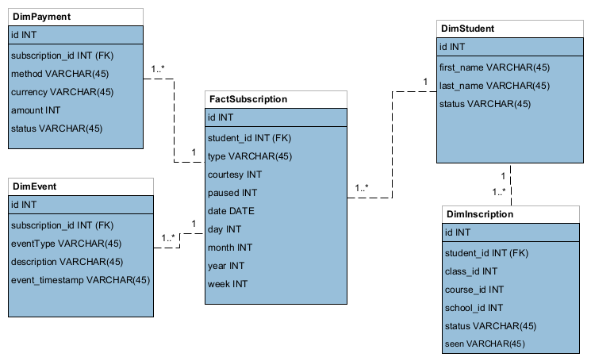

# Challenge

### Prerequisites
- docker-compose 
- docker

# Links
- [Install docker compose](https://docs.docker.com/compose/install/) 
- [Install docker](https://docs.docker.com/engine/install/) 


### 1 ) MR Model


### 2 ) Star Model

### Start

Create and start the dockerized project in a terminal. These commands will start 3 docker containers:
- MySQL DB
- CLI ( Command line interface)
- phpMyAdmin

``` bash
cd Data-Engineer-Test
docker-compose up --build
```

Check if containers are up and running:

``` bash
docker ps
```


Open a new terminal and execute the following commands:


**Load all the .csv files to the database**
``` bash
docker exec -it cli bash actions load_all_csv
```

**Execute ETL job**
``` bash
docker exec -it cli bash actions run_etl
```

**Optional: Clear the MySQL database** (optional, run when database is full)
``` bash
docker exec -it cli bash actions clear_db
```

Yo can connect to the database using PhpMyAdmin in localhost:
``` 
	http://localhost:8080/

```
# Query
## Query 1)
¿ Cómo podemos saber cuántos estudiantes nuevos tenemos por suscripción semana a semana y mes por mes?

``` sql
	SELECT 
		COUNT(DISTINCT (student_id)) qty_students, week, type
	FROM
		challenge.FactSubscription
	GROUP BY week , type;
```
``` sql
	SELECT 
		COUNT(DISTINCT (student_id)) qty_students, month, type
	FROM
		challenge.FactSubscription
	GROUP BY month , type;
```
## Query 2)

¿Cuántos cursos ha tomado el estudiante con más del 80% de las clases vistas?
``` sql
	SELECT 
	    v.student_id, COUNT(v.course_id) qty_courses
	FROM
	    (SELECT 
	        student_id, course_id, SUM(seen) / COUNT(seen) viewed
	    FROM
	        challenge.DimInscription
	    GROUP BY student_id , course_id) v
	WHERE
	    viewed > 0.8
	GROUP BY v.student_id
```

## Query 3
¿El estudiante ha tenido pausas o cortesías en su suscripción?

``` sql
	SELECT 
		student_id, first_name, last_name
	FROM
		challenge.FactSubscription sub
			LEFT JOIN
		challenge.DimStudent stu ON stu.id = sub.student_id
	WHERE
		sub.paused IS NOT NULL;
```
``` sql
	SELECT 
		student_id, first_name, last_name
	FROM
		challenge.FactSubscription sub
			LEFT JOIN
		challenge.DimStudent stu ON stu.id = sub.student_id
	WHERE
		sub.courtesy IS NOT NULL;
```